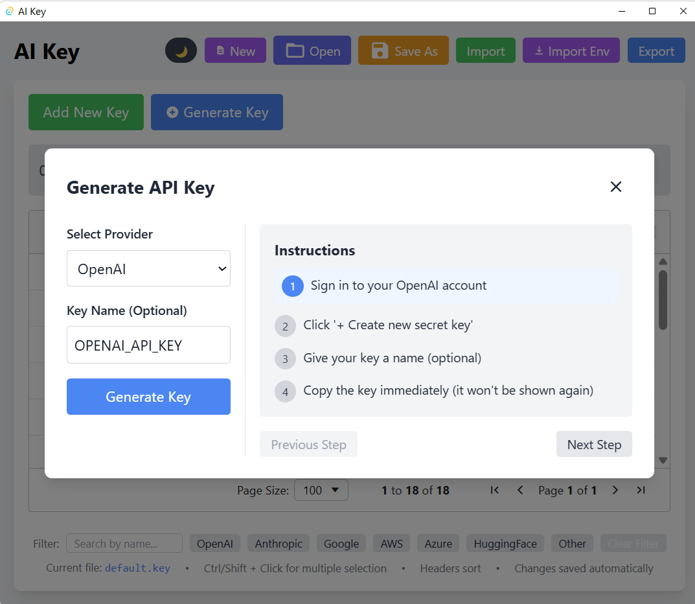

# AI Key Manager


A modern desktop application for securely managing your AI API keys across multiple platforms and services. Built with Tauri 2.0, React, and TypeScript.

<!-- Replace with actual demo GIF -->
<!-- 
<p align="center">
  
</p>
-->

## Screenshot Gallery

<p align="center">
  
</p>

<!-- Add actual screenshots here -->
<!-- Example:
<p align="center">
  
  
</p>
<p align="center">
  
  
</p>
-->

## Features

- **Storage**: All API keys are stored locally on your device
- **Multi-Provider Support**: Auto-detection and categorization for popular AI services:
  - OpenAI (GPT-3.5, GPT-4)
  - Anthropic (Claude)
  - Google (Gemini)
  - Microsoft Azure
  - Hugging Face
  - AWS
  - And more...
- **Import/Export**:
  - Import API keys from various formats (.env, .json, .csv, .txt)
  - Export keys to different formats for easy use in other applications
- **Key Management**:
  - Add, edit, copy, and delete API keys
  - Organize keys with tags and categories
  - Search and filter to quickly find the keys you need
- **Environment Integration**:
  - Automatically set API keys as environment variables for your applications
  - Configure environment variable names for each provider
- **Modern UI**:
  - Responsive design with light and dark mode support
  - Data grid with sorting and filtering
  - Intuitive key editing interface
- **Cross-Platform**: Works on Windows, macOS, and Linux

## Installation

### Windows
1. Download the latest `.msi` installer from the [Releases](https://github.com/fionatony/aikey/releases) page
2. Run the installer and follow the prompts
3. Launch AI Key Manager from your Start menu

### macOS
1. Download the latest `.dmg` file from the [Releases](https://github.com/fionatony/aikey/releases) page
2. Open the `.dmg` file and drag the application to your Applications folder
3. Launch AI Key Manager from your Applications folder

### Linux
1. Download the appropriate package for your distribution from the [Releases](https://github.com/fionatony/aikey/releases) page:
   - `.deb` for Debian/Ubuntu
   - `.AppImage` for universal Linux support
2. Install or run the package according to your distribution's procedures

## Usage

### Managing Keys

1. **Adding Keys**: Click the "Add Key" button and enter your API key details
2. **Editing Keys**: Double-click on any key in the table to edit its properties
3. **Copying Keys**: Select a key and use the copy button or context menu
4. **Deleting Keys**: Select keys and click the delete button or use the delete key

### Importing and Exporting

#### Import
1. Click "Import" and select a file containing API keys
2. Review detected keys in the preview dialog
3. Choose how to handle conflicts (keep existing, replace, or skip)
4. Confirm import

#### Export
1. Select the keys you want to export (or export all)
2. Click "Export" and choose your preferred format
3. Save the file to your desired location

### Key Auto-Detection

The application intelligently detects and categorizes API keys based on patterns:

- **OpenAI**: Keys containing "openai", "gpt", or values starting with "sk-"
- **Google**: Keys containing "google", "gcp", "gemini", or "api_key"
- **Anthropic**: Keys containing "claude" or "anthropic"
- **Microsoft Azure**: Keys containing "azure", "microsoft", or "cognitive"
- **Hugging Face**: Keys containing "huggingface" or values starting with "hf_"
- **AWS**: Keys containing "aws" or values matching AWS key patterns

Keys that don't match these patterns are categorized as "Other".

### Environment Variable Integration

You can set up the application to automatically configure environment variables for your projects:

1. Select a key from your list
2. Click "Set as Environment Variable"
3. Choose the environment variable name or use the suggested default
4. Select the target application or project
5. The API key will be automatically available as an environment variable when you run the target application

## Development

### Prerequisites

- [Node.js](https://nodejs.org/) (v18 or higher)
- [Rust](https://www.rust-lang.org/tools/install) (latest stable)
- [Tauri CLI](https://tauri.app/v2/guides/getting-started/prerequisites/)

### Setup

1. Clone the repository:
```bash
git clone https://github.com/fionatony/aikey.git
cd aikey
```

2. Install dependencies:
```bash
npm install
```

3. Start the development server:
```bash
npm run tauri dev
```

### Building

To build the application for production:

```bash
npm run tauri build
```

The built application will be available in the `src-tauri/target/release` directory.

## Technologies

- [Tauri 2.0](https://tauri.app/) - Lightweight, secure desktop apps with web frontend
- [React](https://reactjs.org/) - UI framework
- [TypeScript](https://www.typescriptlang.org/) - Type-safe JavaScript
- [Material-UI](https://mui.com/) - React components
- [AG Grid](https://www.ag-grid.com/) - Powerful data grid component
- [TailwindCSS](https://tailwindcss.com/) - Utility-first CSS framework
- [Vite](https://vitejs.dev/) - Frontend build tool

## License

This project is licensed under the MIT License - see the [LICENSE](LICENSE) file for details.

## Contributing

Contributions are welcome! Please feel free to submit a Pull Request.

1. Fork the repository
2. Create your feature branch (`git checkout -b feature/amazing-feature`)
3. Commit your changes (`git commit -m 'Add some amazing feature'`)
4. Push to the branch (`git push origin feature/amazing-feature`)
5. Open a Pull Request

## Acknowledgements

- [Tauri Team](https://tauri.app/)
- [OpenAI](https://openai.com/)
- [All Contributors](https://github.com/fionatony/aikey/graphs/contributors)
